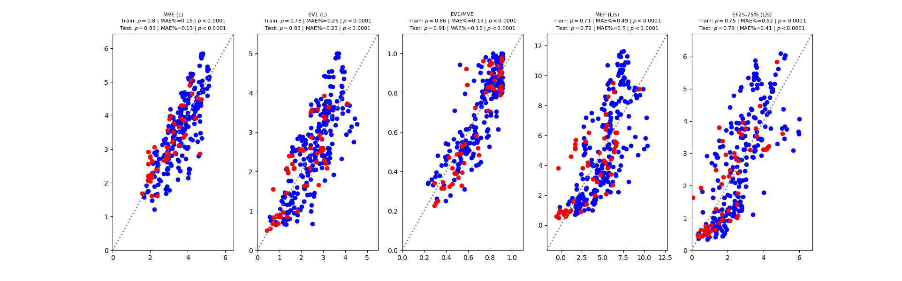
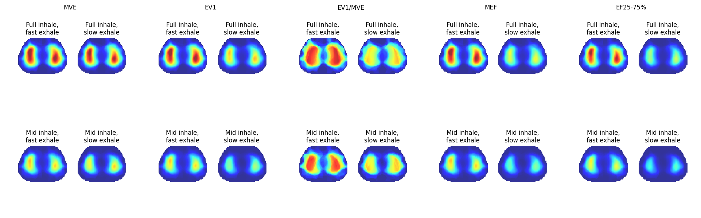
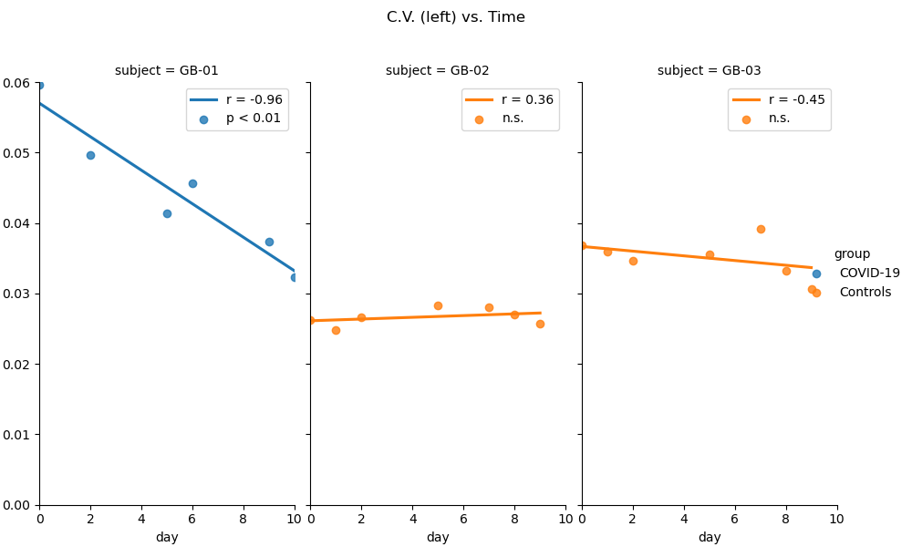
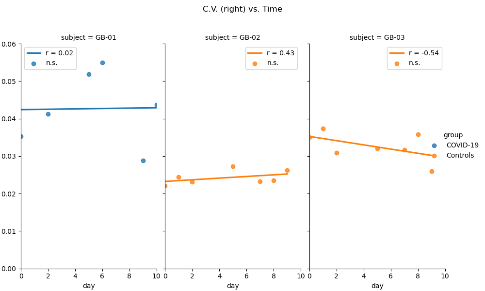

# portable_eit_01
This repository contains codes and part of data used in the publication of "Portable electrical impedance tomography enables  home-based global and regional lung function assessment"

## Code Setup
- Clone ``portable_eit_01`` repository
```bash
git clone https://github.com/gensetech/portable_eit_01.git
```

- Clone ``pyEIT`` repository

```bash
git clone https://github.com/liubenyuan/pyEIT.git
```
- Ensure that ``pyEIT`` version is suitable

This code was tested with pyEIT version (eaa0b79). 
It is not guaranteed that newer or older versions produce the same results in the paper.
Therefore, it is recommended to switch to version (eaa0b79). This can be done as follows:
```bash 
cd pyEIT
git checkout eaa0b79
```
- Download data and executables from this [link](https://drive.google.com/drive/folders/1gR2b_CHBRYhKYtxNeAH1VXY6V5nNn8dT?usp=sharing)

- Install requirements 
  - Install [python](https://www.python.org/downloads/) (This code is tested with python 3.8) 
  - Install [pyEIT](https://github.com/liubenyuan/pyEIT) requirements
  - Install packages in ```requirements.txt```

## Run the code

### Forced breathing

Run `scripts/forced_breathing_processing.py`





### Guided breathing

#### Different breathing depths

Run `scripts/guided_breathing_different_depths_processing.py`

 


#### COVID and healthy subjects

Run `scripts/guided_breathing_COVID19_processing.py`





